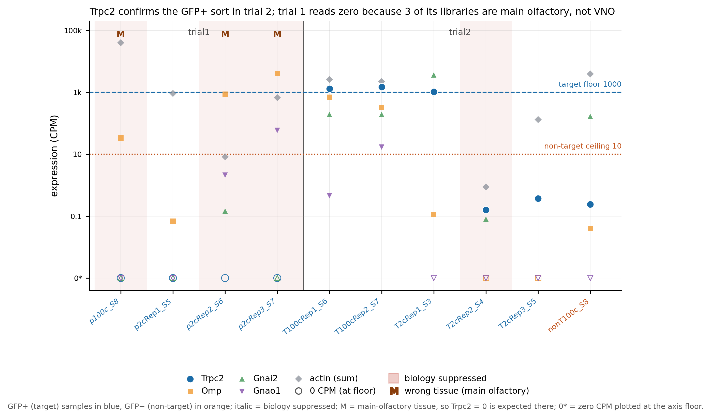
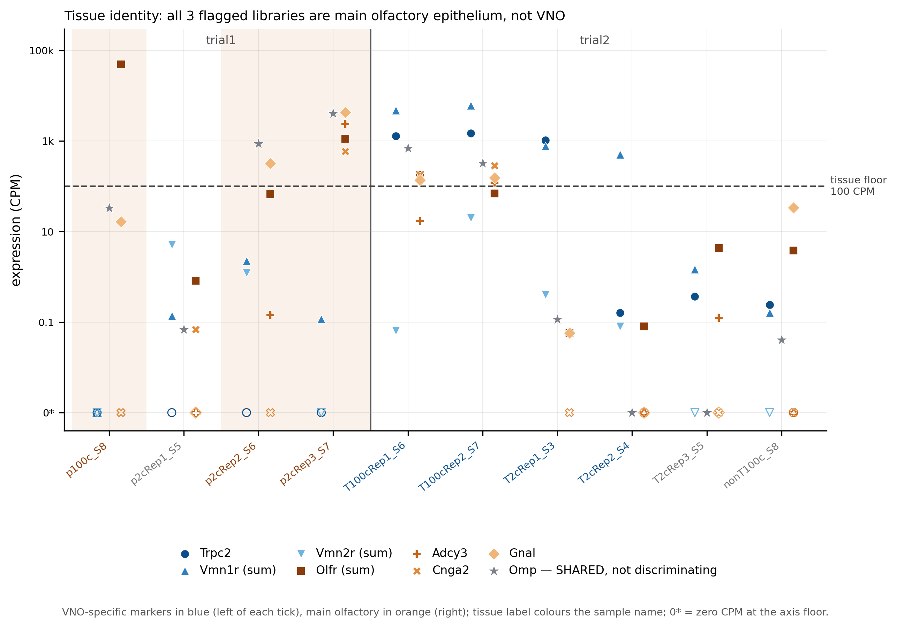
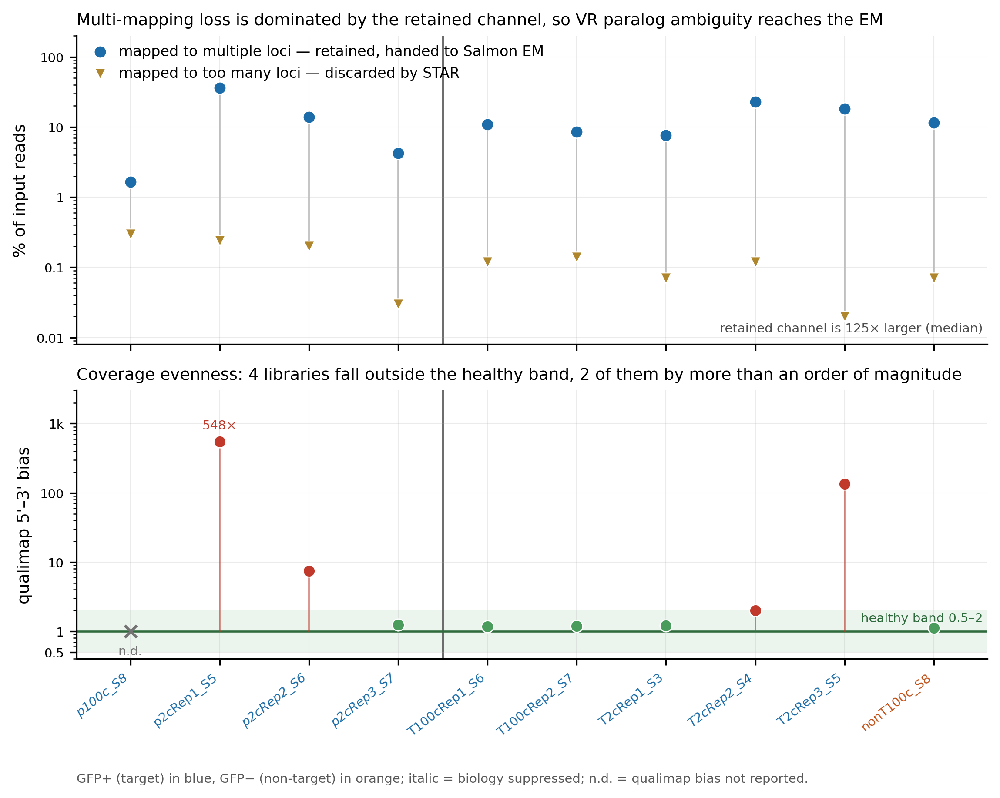
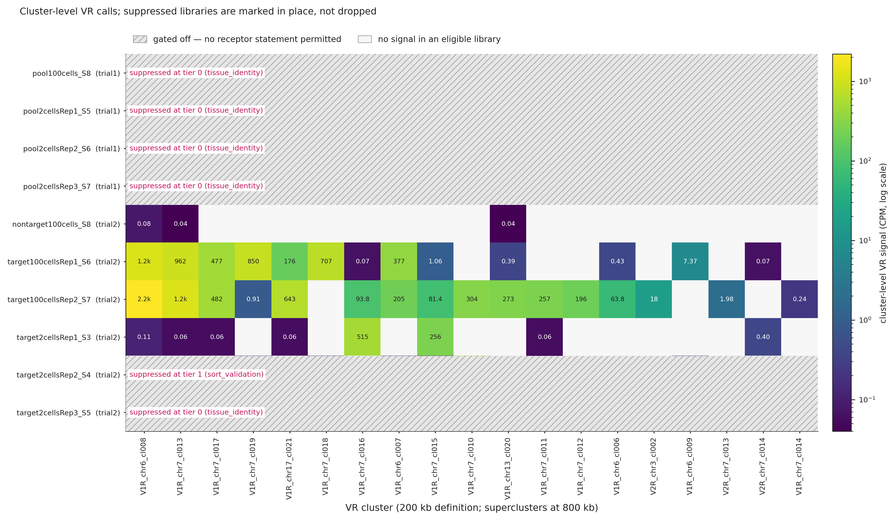
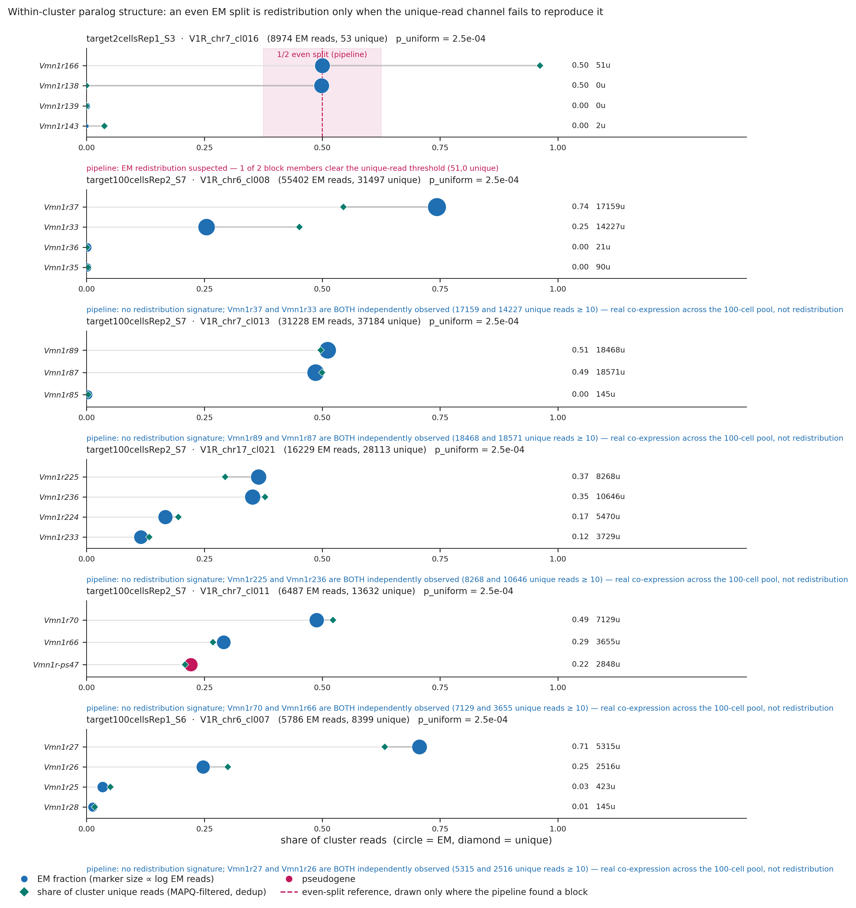
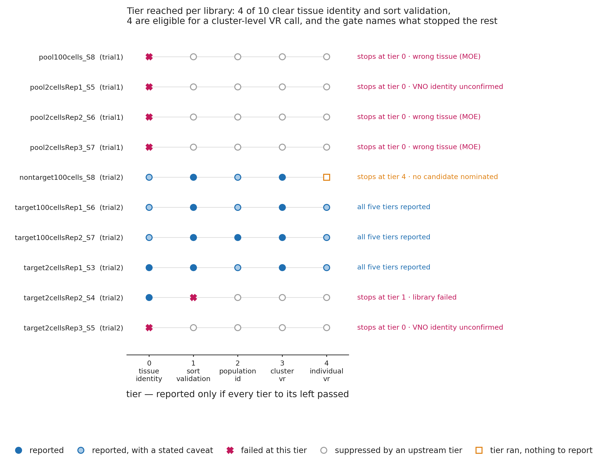

# VNO vomeronasal-receptor RNA-seq — analysis report

Stowers Lab (Natalie Cole) / Scripps CCBB. Mouse vomeronasal organ, OMP-Cre × GFP reporter, FACS-sorted GFP+ / GFP−, Takara Smart-seq HT, 2-cell and 100-cell pools, 2×75bp PE, two trials.

Generated 2026-08-20 14:50 by `bin/vr_write_reports.py` from the tables under `results/`. Every figure quoted below is read from those tables at generation time.

---

## 1. The finding that reframes the dataset: trial 1 is the wrong tissue

**3 of the 4 trial-1 libraries are main olfactory epithelium (MOE), not vomeronasal organ; the remaining one carries no tissue signal at all. No vomeronasal-receptor biology is reportable from any of them.** This is not a library-quality problem and it is not fixable computationally; the remedy is at the bench.

The distinction between the two verdicts matters and the pipeline keeps them separate. `MOE` is positive evidence of the wrong tissue. `no_tissue_signal` means both marker panels sit below the 100 CPM floor, so the library carries no tissue information either way — it is uninformative, **not** evidence of MOE. Both block downstream interpretation, but only the first supports a statement about what the tissue was.

The tissue-identity panel compares MOE markers (*Olfr* family sum, *Adcy3*, *Cnga2*, *Gnal*) against VNO-specific markers (*Trpc2*, *Vmn1r* sum, *Vmn2r* sum) on the maximum panel member, with a 100 CPM absolute floor so that a ratio of two noise values cannot produce a verdict.

| library | tissue verdict | *Olfr* sum | *Adcy3* | *Gnal* | *Trpc2* | *Vmn1r* sum | *Omp* |
|---|---|---|---|---|---|---|---|
| pool100cells_S8 | **MOE** | 48,729 | 16 | 16 | 0.00 | 0.00 | 33 |
| pool2cellsRep1_S5 | **no_tissue_signal** | 1 | 0 | 0 | 0.00 | 0.14 | 0 |
| pool2cellsRep2_S6 | **MOE** | 67 | 0 | 320 | 0.00 | 2.25 | 864 |
| pool2cellsRep3_S7 | **MOE** | 1,113 | 2,375 | 4,277 | 0.00 | 0.12 | 4,028 |

All CPM. `pool2cellsRep1_S5` is the `no_tissue_signal` case: its MOE panel maxes at 0.8 CPM and its VNO panel at 5.1, both far under the floor, so no tissue claim is made about it. Note also that `pool2cellsRep2_S6`'s MOE call is the weakest of the three — it rests on *Gnal* at 320 CPM, since its *Olfr* sum (67 CPM) is itself below the floor — but its VNO panel is 2.2 CPM, so the direction is not in doubt.

Two consequences deserve stating plainly.

**The briefing's "cleanest 2-cell sample across both trials" is a textbook mature main-olfactory neuron.** `pool2cellsRep3_S7` is indeed the technically cleanest trial-1 library (43.0% uniquely mapped, 38.0% duplication) — and it reads *Adcy3* 2,375, *Cnga2* 585, *Gnal* 4,277, *Olfr* sum 1,113 CPM, with *Trpc2* exactly zero. Library cleanliness and correct tissue are independent properties. The cleanliness is exactly why the sample was trusted.

***Omp* is why an MOE library can look like a successful GFP+ VNO sort.** OMP-Cre drives GFP in mature main-olfactory neurons as well as VNO neurons, so *Omp* is tissue-shared: `pool2cellsRep3_S7` reads *Omp* 4,028 CPM. A GFP+ sort from MOE tissue is GFP+ and *Omp*-high and still carries no vomeronasal receptor. *Omp* must never be used as a VNO-specific marker.

The tissue problem is not confined to trial 1: in trial 2, `target2cellsRep3_S5` also stops at the tissue gate with `no_tissue_signal` (MOE max 4.3, VNO max 1.5 CPM). That is a library failure rather than a dissection failure, but it stops at the same gate.

This is not a quantification artifact. The same annotation quantified both trials and yields 17,919–37,230 *Trpc2* counts in the trial-2 VNO libraries. `pool100cells_S8` carries 48,729 CPM of *Olfr* signal — ~4.9% of the library — with zero VR signal.

---

## 2. What is usable: 4 of 10 libraries, 3 of them GFP+ targets

Clearance requires `qc_overall == 'USABLE'` **and** `suppress_biology == False`. The second condition is not redundant: two libraries carry `suppress_biology=False` while `sort_verdict=FAIL`, so gating on that column alone would have admitted them.

| library | trial | cells | tissue | sort | population | library | highest tier reported |
|---|---|---|---|---|---|---|---|
| pool100cells_S8 | trial1 | 100 | MOE | FAIL_WRONG_TISSUE | undetermined | DEGENERATE | -1 |
| pool2cellsRep1_S5 | trial1 | 2 | no_tissue_signal | FAIL | undetermined | OK | -1 |
| pool2cellsRep2_S6 | trial1 | 2 | MOE | FAIL_WRONG_TISSUE | V2R_dominant | FAILED | -1 |
| pool2cellsRep3_S7 | trial1 | 2 | MOE | FAIL_WRONG_TISSUE | V2R_dominant | OK | -1 |
| nontarget100cells_S8 | trial2 | 100 | no_tissue_signal | PASS | V1R_dominant | OK | 3 |
| target100cellsRep1_S6 | trial2 | 100 | VNO_dominant_mixed | PASS | V1R_dominant | OK | 4 |
| target100cellsRep2_S7 | trial2 | 100 | VNO_dominant_mixed | PASS | V1R_dominant | OK | 4 |
| target2cellsRep1_S3 | trial2 | 2 | VNO | PASS | V1R_dominant | OK | 4 |
| target2cellsRep2_S4 | trial2 | 2 | VNO | FAIL | V1R_dominant | FAILED | 0 |
| target2cellsRep3_S5 | trial2 | 2 | no_tissue_signal | FAIL | V1R_dominant | OK | -1 |

`highest_tier_reported = -1` means nothing was reported at all — the library stopped at tier 0, the tissue gate. `0` means tier 0 passed and was reported, then a later tier failed.

**The failed-library gate does real work.** `target2cellsRep2_S4` is VNO tissue (it passes tier 0), then fails sort validation: actin sum 0.88 CPM and *Trpc2* 0.16 CPM, both under the failed-library thresholds of 100 and 10. Yet it carries **501.5 CPM of *Vmn1r* signal**, and produces 0 candidate receptor rows. VR family signal can survive a library that fails every other check; it must never be read as a receptor call.

---

## 3. Sort validation (tier 1)

Rule 1 of the interpretation hierarchy: if the sort does not validate, nothing downstream is reportable.

| library | *Trpc2* CPM | *Trpc2* raw reads | verdict |
|---|---|---|---|
| target100cellsRep1_S6 | 1,293.01 | 19,846 | PASS |
| target100cellsRep2_S7 | 1,476.07 | 37,230 | PASS |
| target2cellsRep1_S3 | 1,029.19 | 17,919 | PASS |
| nontarget100cells_S8 | 0.24 | 6 | PASS |

The three GFP+ targets read 1,029–1,476 CPM *Trpc2* against 0.24 CPM in the GFP− library. The separation is unambiguous and the sort passes.

**Do not quote the enrichment as a fold-change.** Across all three cleared GFP+ targets the ratio computes to ~4,292× (`target2cellsRep1_S3`), ~5,392× (`target100cellsRep1_S6`) and ~6,155× (`target100cellsRep2_S7`) — a range that brackets the briefing's ~5000×. But the denominator is 6 raw reads. The 95% Poisson interval on a count of 6 spans roughly 2–13 reads, so the implied fold ranges from about 2,400× to 16,000× without anything changing in the biology. Report the two CPMs; the direction is the result, the magnitude is an artifact of dividing by near-zero.

**Sort purity.** The GFP− library's total VR signal is 0.160 CPM — four VR genes carrying exactly one assigned count each — against a purity ceiling of 100 CPM. This is trace carry-over, and no cluster in that library is called.

---

## 4. Population identity (tier 2)

V1R neurons signal through Gnai2, V2R neurons through Gnao1, so the *Gnai2*:*Gnao1* ratio assigns the population. The config requires ≥10 raw *Gnao1* reads before the ratio's **magnitude** is quotable; below that the direction still holds but the number is Poisson-unstable.

| library | *Gnai2* CPM | *Gnao1* CPM | *Gnao1* raw reads | ratio | magnitude quotable | call |
|---|---|---|---|---|---|---|
| target100cellsRep1_S6 | 192.8 | 0.46 | 7 | 422.7:1 | no | V1R_dominant |
| target100cellsRep2_S7 | 192.4 | 16.97 | 428 | 11.3:1 | yes | V1R_dominant |
| target2cellsRep1_S3 | 3,602.2 | 0.00 | 0 | infinity | no | V1R_dominant |
| nontarget100cells_S8 | 165.4 | 0.00 | 0 | infinity | no | V1R_dominant |

All three targets are **V1R-dominant**, consistent with the cluster-level VR evidence in §5 (every called cluster in every target is V1R). Only `target100cellsRep2_S7` has a quotable ratio (11.3:1 on 428 *Gnao1* reads).

The briefing's 385:1 for `target100cellsRep1_S6` recomputes to 422.7:1. **This is the same measurement, not a discrepancy**: *Gnao1* = 7 reads is the entire denominator, and one read either way moves the ratio by ~15%. Neither number should be quoted as precise.

Note the trap the marker panel avoids: the GFP− library reads *Gnai2* 165 CPM with zero *Gnao1* and essentially no VR signal, giving a formally infinite "V1R-dominant" ratio. *Gnai2*/*Gnao1* split V1R from V2R **within** the VNO; they are not tissue markers and are excluded from the tissue panel for exactly this reason.

---

## 5. Cluster-level VR expression (tier 3) — the reliable tier

~250 *Vmn1r* and ~120 *Vmn2r* genes sit in genomic clusters of local duplicates at 85–95% nucleotide identity. At this read length, reads cannot be uniquely assigned within a cluster, and Salmon's EM spreads ambiguous reads across paralogs. Cluster-level aggregation is therefore the reportable readout; per-gene counts inside a cluster are not.

**The ambiguity is retained, not filtered.** Across all ten libraries, STAR's retained multiple-loci reads are 1.66–36.35% of input, versus 0.02–0.30% discarded as too-many-loci. The retained channel dominates in all 10/10 libraries by a median factor of ~125×. Paralog ambiguity lands in Salmon's EM, so cluster aggregation is mandatory.

### target100cellsRep1_S6 — 100-cell pool, total VR 4,736.3 CPM, 7 clusters called

| cluster | family | members | detected | CPM | share of VR |
|---|---|---|---|---|---|
| V1R_chr6_cl008 | V1R | 9 | 3 | 1,177.4 | 24.9% |
| V1R_chr7_cl013 | V1R | 6 | 1 | 962.1 | 20.3% |
| V1R_chr7_cl019 | V1R | 1 | 1 | 850.3 | 18.0% |
| V1R_chr7_cl018 | V1R | 2 | 1 | 706.7 | 14.9% |
| V1R_chr7_cl017 | V1R | 18 | 3 | 477.2 | 10.1% |
| V1R_chr6_cl007 | V1R | 21 | 4 | 377.0 | 8.0% |
| V1R_chr17_cl021 | V1R | 24 | 3 | 176.2 | 3.7% |

### target100cellsRep2_S7 — 100-cell pool, total VR 6,056.0 CPM, 9 clusters called

| cluster | family | members | detected | CPM | share of VR |
|---|---|---|---|---|---|
| V1R_chr6_cl008 | V1R | 9 | 4 | 2,196.6 | 36.3% |
| V1R_chr7_cl013 | V1R | 6 | 3 | 1,238.1 | 20.4% |
| V1R_chr17_cl021 | V1R | 24 | 4 | 643.4 | 10.6% |
| V1R_chr7_cl017 | V1R | 18 | 2 | 481.9 | 8.0% |
| V1R_chr7_cl010 | V1R | 14 | 1 | 304.2 | 5.0% |
| V1R_chr13_cl020 | V1R | 64 | 3 | 272.7 | 4.5% |
| V1R_chr7_cl011 | V1R | 12 | 3 | 257.2 | 4.2% |
| V1R_chr6_cl007 | V1R | 21 | 1 | 205.4 | 3.4% |
| V1R_chr7_cl012 | V1R | 29 | 4 | 196.4 | 3.2% |

### target2cellsRep1_S3 — 2-cell pool, total VR 772.0 CPM, 2 clusters called

| cluster | family | members | detected | CPM | share of VR |
|---|---|---|---|---|---|
| V1R_chr7_cl016 | V1R | 23 | 4 | 515.4 | 66.8% |
| V1R_chr7_cl015 | V1R | 37 | 2 | 255.9 | 33.1% |

The 2-cell pool `target2cellsRep1_S3` calls exactly 2 clusters, consistent with 2 cells each making one choice. The 100-cell pools call 7 and 9 clusters — well below the 100 distinct choices a fully diverse pool would show, i.e. the sorted populations are skewed toward a few clusters.

### Report both cluster tiers for the chr7 region

The briefing's "cluster 039 at 99.9%" for `target2cellsRep1_S3` reproduces **at the 800kb supercluster tier**: `V1R_chr7_sc013` = 99.91% of the sample's VR signal. At the 200kb cluster tier the same signal resolves into 66.8% `V1R_chr7_cl016` + 33.1% `V1R_chr7_cl015`. A 217,366bp gap between *Vmn1r132* and *Vmn1r135* exceeds the 200kb rule by 17kb and splits the briefing's single cluster in two.

Neither tier is more correct. 200kb is not a natural break — the V1R inter-gene gap distribution has its KDE minimum near 2Mb — so it is a conservative convention, and the 800kb tier exists because that convention has a visible consequence here. Report both for this region and treat `cl039`/`cl029` as aliases resolved through membership, not ordinals.

**V2R aggregation is weaker than V1R.** 18 of 37 V2R clusters are singletons and only 180/222 V2R genes sit in clusters of ≥5, so aggregation buys less protection against EM artifacts for V2R than for V1R. No V2R cluster is called in any library here, so this does not affect the present calls — but it constrains any future V2R-dominant sample.

---

## 6. EM redistribution vs co-expression

Within-cluster fractions are tested against 1/k by Monte Carlo from Multinomial(N, 1/k) at the observed N and k (4000 draws), not the asymptotic chi-square, which is invalid at N of tens. Power against a monogenic alternative (dominant at 0.90) is simulated too; power < 0.80 grades a pair `indeterminate_low_depth`.

**An even split is necessary but not sufficient for an EM artifact.** Monogenic choice is a per-**cell** rule, so a multi-cell pool can legitimately capture two paralogs of one cluster. The pipeline therefore applies a unique-read gate: within a detected even block, each member's unique MAPQ255 deduplicated reads are compared against max(10 reads, 3× the median unique count of cluster members outside the block — the cluster's own measured mismapping floor). One member clearing it means redistribution; two or more means co-expression.

### The one flagged artifact

`target2cellsRep1_S3` / `V1R_chr7_cl016` — **suspected_em_redistribution** (strong).

- EM fractions 0.500 (*Vmn1r166*, 4,489 counts) and 0.498 (*Vmn1r138*, 4,473 counts) over 8,962 reads in the block.
- Cluster-level `p_uniform` = 2.4994e-04, which is the Monte-Carlo **floor** (1/4001). Quote it as *p* < 2.5×10⁻⁴, a bound, not a point estimate.
- Within-block `p_uniform` = 0.86 — **high by design**. That is what "indistinguishable from an even split" means, and it is why the block was detected. Block power = 1.00.
- Unique MAPQ255 deduplicated reads: *Vmn1r166* 51 vs *Vmn1r138* 0. Gate threshold 10; 1 of 2 members clear it.

**Preserve the asymmetry.** The *call* is solid: a paralog holding 4,473 EM counts with **zero** single-locus reads is not independently observed, and EM splitting one transcript's reads explains it. But *which* paralog is the source rests on 51 unique reads — about 1.1% of *Vmn1r166*'s apparent expression. The artifact is established; the receptor identity is `tentative_unconfirmed`.

### Retracted: V1R_chr7_cl013 in target100cellsRep2_S7 is NOT an artifact

An earlier reporting figure called this a genuine EM signature. It is not. `em_flag = no_redistribution_signature`, `even_block_size = 0`, and *Vmn1r89* and *Vmn1r87* carry 35,153 and 32,301 independent unique MAPQ255 reads. This is real co-expression across a 100-cell pool. The figure had applied its own visual evenness criterion instead of reading `em_flag`; it now reads the column. **Do not reintroduce this claim** — it is the exact false positive the unique-read gate exists to prevent.

### Pseudogene signal: an open mechanism, not a demonstrated artifact

Largest instance: *Vmn1r-ps150* holds 38.0% of `V1R_chr17_cl021` in `target100cellsRep1_S6`, with 3,655 unique MAPQ255 reads — and that cluster is **clean** on the redistribution test (`em_flag = no_redistribution_signature`). An even-split artifact does not explain it.

Two mechanisms remain open and are not separable here: (a) EM leakage from an expressed functional paralog in the same cluster, (b) genuine transcription of the pseudogene locus, e.g. via cluster-shared regulatory elements. **Dietschi et al. 2022 is not a quantitative mouse prior for this**: their pseudogene result was significant in rat (*P* = 0.003) but not in mouse (*W* = 1214, *P* = 0.5704), and the mechanism they propose is regulatory, not multi-mapping. The flag reports the ambiguity rather than asserting bleed-through.

---

## 7. Individual receptor candidates (tier 4) — all tentative

Ranking uses `bam_unique_mapq255` (MAPQ 255 = STAR placed the read at exactly one locus), counted mate-wise, with and without duplicates. **All 26 candidate rows carry `confirmation_status = tentative_unconfirmed`.** No individual receptor identification in this dataset is confirmed.

### target100cellsRep1_S6

| cluster | rank | gene | unique (all / dedup) | EM counts | EM frac | confidence | em_flag |
|---|---|---|---|---|---|---|---|
| V1R_chr6_cl008 | 1 | *Vmn1r35* | 33,670 / 15,329 | 17,097 | 0.946 | moderate | no_redistribution_signature |
| V1R_chr6_cl008 | 2 | *Vmn1r36* | 1,183 / 896 | 973 | 0.054 | alternative_candidate | no_redistribution_signature |
| V1R_chr6_cl008 | 3 | *Vmn1r37* | 5 / 3 | 1 | 0.000 | alternative_candidate | no_redistribution_signature |
| V1R_chr7_cl013 | 1 | *Vmn1r89* | 33,139 / 18,750 | 14,767 | 1.000 | moderate | single_paralog_only |
| V1R_chr7_cl013 | 2 | *Vmn1r86* | 1 / 1 | 0 | 0.000 | alternative_candidate | single_paralog_only |
| V1R_chr7_cl013 | 3 | *Vmn1r87* | 1 / 1 | 0 | 0.000 | alternative_candidate | single_paralog_only |
| V1R_chr7_cl019 | 1 | *Vmn1r185* | 29,712 / 17,083 | 13,050 | 1.000 | moderate | single_paralog_only |
| V1R_chr7_cl018 | 1 | *Vmn1r184* | 24,549 / 13,560 | 10,847 | 1.000 | moderate | single_paralog_only |
| V1R_chr7_cl017 | 1 | *Vmn1r178* | 25,992 / 15,908 | 7,322 | 1.000 | moderate | no_redistribution_signature |
| V1R_chr7_cl017 | 2 | *Vmn1r183* | 2 / 2 | 1 | 0.000 | alternative_candidate | no_redistribution_signature |
| V1R_chr7_cl017 | 3 | *Vmn1r168* | 2 / 2 | 1 | 0.000 | alternative_candidate | no_redistribution_signature |

### target100cellsRep2_S7

| cluster | rank | gene | unique (all / dedup) | EM counts | EM frac | confidence | em_flag |
|---|---|---|---|---|---|---|---|
| V1R_chr6_cl008 | 1 | *Vmn1r37* | 53,841 / 17,159 | 41,188 | 0.743 | unresolvable | no_redistribution_signature |
| V1R_chr6_cl008 | 2 | *Vmn1r33* | 29,099 / 14,227 | 14,103 | 0.255 | alternative_candidate | no_redistribution_signature |
| V1R_chr6_cl008 | 3 | *Vmn1r35* | 113 / 90 | 50 | 0.001 | alternative_candidate | no_redistribution_signature |
| V1R_chr7_cl013 | 1 | *Vmn1r89* | 35,153 / 18,468 | 15,971 | 0.511 | unresolvable | no_redistribution_signature |
| V1R_chr7_cl013 | 2 | *Vmn1r87* | 32,301 / 18,571 | 15,181 | 0.486 | alternative_candidate | no_redistribution_signature |
| V1R_chr7_cl013 | 3 | *Vmn1r85* | 169 / 145 | 76 | 0.002 | alternative_candidate | no_redistribution_signature |
| V1R_chr17_cl021 | 1 | *Vmn1r236* | 16,723 / 10,646 | 5,717 | 0.352 | unresolvable | no_redistribution_signature |
| V1R_chr17_cl021 | 2 | *Vmn1r225* | 12,671 / 8,268 | 5,925 | 0.365 | alternative_candidate | no_redistribution_signature |
| V1R_chr17_cl021 | 3 | *Vmn1r224* | 8,571 / 5,470 | 2,717 | 0.167 | alternative_candidate | no_redistribution_signature |

### target2cellsRep1_S3

| cluster | rank | gene | unique (all / dedup) | EM counts | EM frac | confidence | em_flag |
|---|---|---|---|---|---|---|---|
| V1R_chr7_cl016 | 1 | *Vmn1r166* | 70 / 51 | 4,489 | 0.500 | moderate | suspected_em_redistribution |
| V1R_chr7_cl016 | 2 | *Vmn1r143* | 2 / 2 | 2 | 0.000 | alternative_candidate | suspected_em_redistribution |
| V1R_chr7_cl015 | 1 | *Vmn1r103* | 186 / 92 | 0 | 0.000 | unresolvable | no_redistribution_signature |
| V1R_chr7_cl015 | 2 | *Vmn1r104* | 186 / 92 | 0 | 0.000 | alternative_candidate | no_redistribution_signature |
| V1R_chr7_cl015 | 3 | *Vmn1r-ps75* | 10 / 10 | 0 | 0.000 | alternative_candidate | no_redistribution_signature |

**Read the evidence columns before quoting a rank.** Several rank1/rank2 unique-read ratios are infinite against a background floor of zero, which means a ranking can rest on very few reads. Two specific cases:

1. **`V1R_chr7_cl015` in `target2cellsRep1_S3` has no nameable receptor.** The EM-dominant paralog *Vmn1r131* holds 99.9% of cluster EM signal (4,452 counts) with **zero** unique reads, while *Vmn1r103* and *Vmn1r104* each carry 92 deduplicated unique reads and **zero** EM counts. The two evidence channels name different genes; neither identifies the expressed receptor. The pipeline emits the contradiction rather than picking a winner. Note what this means for the briefing's clean "99.9% single-cluster" description of this sample: the cluster-level call stands, and the second cluster's individual call does not exist.

2. **The background floor is a flat pedestal, not evidence.** In that same cluster, 26 of 37 members sit at exactly 2 unique reads each — one MAPQ255 read pair apiece, across non-overlapping gene spans. That pedestal is what sets the gate (median 2 → threshold max(10, 3×2) = 10). Counts at that level are noise, and the gate is calibrated to them.

Cross-validation with markers holds throughout: every candidate carries `marker_consistency = consistent`, i.e. V1R calls sit in libraries whose *Gnai2* exceeds *Gnao1*. No VR-versus-marker contradiction arose.

---

## 8. What the data can and cannot support

**Can support:**

1. The sort works. GFP+ VNO libraries are *Trpc2*-high, the GFP− library is *Trpc2*-negative and VR-free at the 0.16 CPM level.
2. The three clean trial-2 GFP+ libraries are V1R-population neurons.
3. Cluster-level receptor assignments for those three libraries, at both the 200kb and 800kb tiers, with the 2-cell pool calling exactly 2 clusters.
4. One documented EM-redistribution event, with the artifact call separated from the source attribution.
5. A negative result with teeth: 6 of 10 libraries yield no biology, and the gates that suppress them are tested (`results/tier_gate_selftest.txt`, 35/35 assertions — a wrong-tissue or failed library cannot reach a receptor call because the producer function is never invoked).

**Cannot support:**

1. Any vomeronasal biology from trial 1. Three libraries are positively MOE and the fourth is tissue-uninformative; neither state is recoverable computationally.
2. A confirmed individual receptor identity for any cell. Every candidate is `tentative_unconfirmed`; one dominant cluster has no nameable receptor at all.
3. Per-gene VR expression levels within a cluster. This is the multi-mapping limit, not a depth limit.
4. Any quantitative fold-change against the GFP− library, whose relevant counts are 0–6 reads.
5. A mechanism for the pseudogene signal.
6. Anything from `target2cellsRep2_S4` despite its 501.5 CPM of *Vmn1r*.

**Most actionable for the lab:** the trial-1 tissue finding — check the dissection and the sort gate before spending another sequencing run, and note that a GFP+ *Omp*-high sort is not self-validating — and the observation that with only 3 usable GFP+ libraries, the planned 150bp PE upgrade addresses read length but not sample count. See `OPEN_QUESTIONS.md` §6 for what 150bp does and does not buy.

---

## 9. Reproducibility of this run

This report comes from a cold-start run: `results/` was moved aside to `results.prerun_backup/` and every table, report and figure was regenerated from `config/project.yaml` plus the nf-core/rnaseq trees. Diffing the regenerated tree against the backup over 36 paths: **EXTRA_NEW** 1, **IDENTICAL** 31, **MISSING_NEW** 1, **TIMESTAMP_ONLY** 3.

Non-reproduced paths:

- `vr_cluster_map.png` — MISSING_NEW: in backup, not regenerated

Findings verification: **24/24** recorded findings reproduce (`results/findings_verification.tsv`). The reference build is byte-identical when rebuilt from the 852MB GTF into a scratch directory (`results/refcheck_diff.txt`).

Claim-by-claim reconciliation against the briefing: `results/reconciliation.tsv`.

