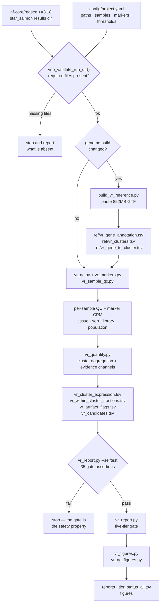
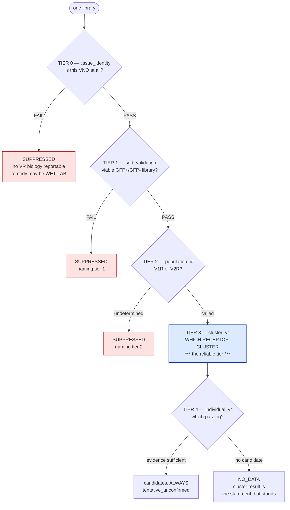
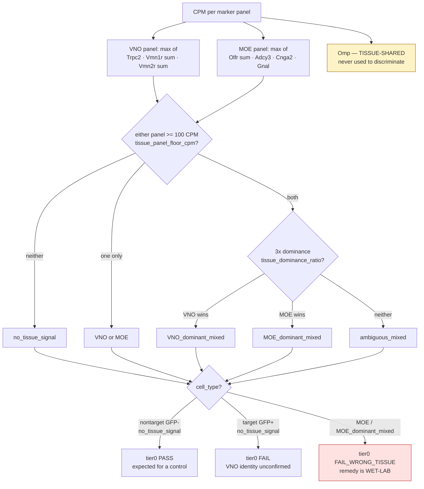
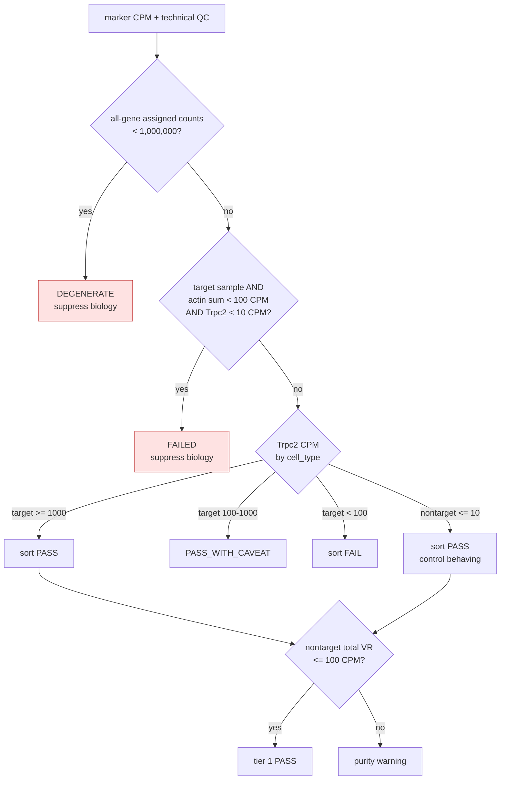
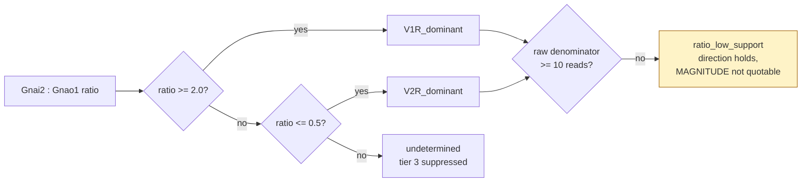
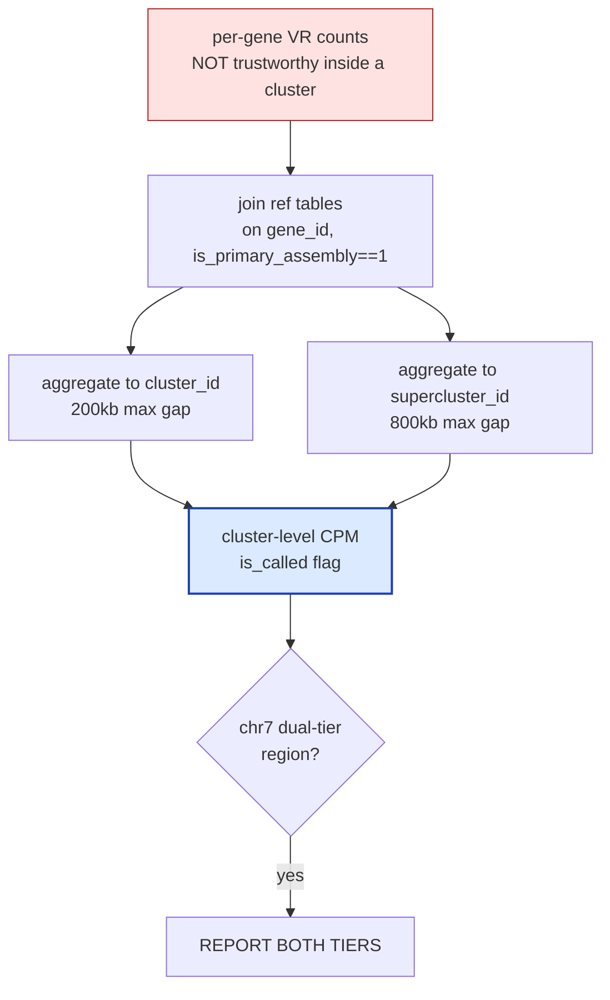
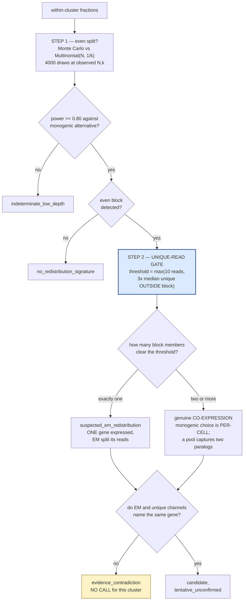
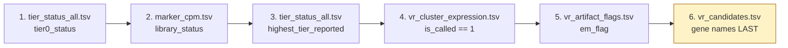

# VNO receptor pipeline — what runs, in what order, and why

Companion to `vno-receptor-rnaseq` (the skill) and `vr_analysis/README.md` (the
work folder). Every threshold, flag value and vocabulary below was read from
`config/project.yaml` and `vno_flag_vocabulary()` at the time of writing, not
recalled — if the config changes, this document is stale and the config wins.

**The one-sentence design.** Each mouse VNO sensory neuron expresses exactly one
vomeronasal receptor, but ~250 V1R and ~120 V2R genes sit in clusters of local
duplicates sharing 85–95% nucleotide identity, so 75bp reads cannot be uniquely
assigned within a cluster. The pipeline's job is therefore not to quantify — it
is to establish *how far down the chain of claims the data actually supports*,
and to make the stopping point structural rather than a matter of the analyst's
discipline.

---

## 1. Top-level flow

**Why the reference step is conditional.** The GTF parse is the only expensive
stage and its output depends solely on the genome build, not the samples. Two
non-obvious facts are baked into it: this GTF has **no `gene` feature rows**, so gene spans are aggregated from transcript rows with an independent
exon-derived cross-check; and joins must use `gene_id`, never `gene_name`,
because `Vmn1r-ps5` and `Vmn2r118` each map to two distinct gene_ids on
different chromosomes.

**Why the self-test gates the report.** The tier ladder is the pipeline's only
real safety property. A self-test that runs *after* the report would tell you
the guarantee was broken once the output already existed.

---

## 2. The five-tier ladder — the core of the design

**Why a ladder and not a scorecard.** Each tier is a precondition for the next
being *meaningful*, not merely for it being *reliable*. A receptor name computed
from a wrong-tissue library is not a low-confidence answer — it is an answer to a
question nobody asked.

**Why it is enforced structurally.** Each tier's content comes from a callable
that `TierGate.emit()` refuses to invoke unless every upstream tier passed. A
wrong-tissue library cannot reach a receptor call because the producer function
is never called; the gate substitutes an explicit suppression line naming the
failing tier. This is the difference between a convention and a guarantee: the
self-test includes spy producers that assert zero invocations for a failed
library, so "the analyst remembered to check" is not load-bearing.

`tier_status` vocabulary: `PASS`, `PASS_WITH_CAVEAT`, `FAIL`, `NO_DATA`,
`SUPPRESSED`.

---

## 3. Tier 0 — tissue identity

**Why this tier exists at all — it was added after the fact, and it is the single
most valuable step.** OMP-Cre drives GFP in mature *main olfactory* neurons as
well as VNO neurons. A GFP+ sort from the wrong tissue therefore yields
Omp-high, Trpc2-zero cells that look like a **successful** sort. Four libraries
in this project were briefed as "failed / degraded preps"; they were main
olfactory epithelium (`Olfr` sum 48,729 CPM — about 4.9% of one library — with
zero VR signal), and the sample described as the cleanest of the set was a
textbook mature MOE neuron (Adcy3 2,374, Cnga2 585, Gnal 4,277, Trpc2 0).

**Why an absolute floor and not just a ratio.** A ratio of two sub-noise values
carries no tissue information. The first version of this rule used dominance
alone and mislabelled low-signal libraries; the 100 CPM floor fixed it.

**Why `Gnai2`/`Gnao1` are excluded from these panels.** They split V1R vs V2R
*within* the VNO and are broadly expressed elsewhere — `Gnai2` reads 165 CPM in
a GFP− library carrying no VR signal at all. They are tier-2 markers only.

**Why `tissue_verdict` is not a boolean.** Six values, and they do not map
one-to-one onto pass/fail: `no_tissue_signal` in a GFP− control is the expected
result and passes; the same value in a GFP+ target is a stop. Read
`tier0_status`, which accounts for `cell_type`.

---

## 4. Tier 1 — library viability and sort validation

**Why a `DEGENERATE` check separate from the CPM thresholds.** CPM is a ratio, so
a near-empty library can look healthy: one library showed 39,881 CPM of actin
from only 60,744 total assigned counts. Without an absolute count floor, every
downstream threshold is being applied to noise scaled up to look like signal.

**Why the failed-library gate uses actin AND Trpc2 together.** Either alone is
ambiguous — low actin could be a shallow but real library, low Trpc2 could be
the wrong tissue (which tier 0 already caught). Together they identify an
empty/failed prep.

**The case this gate exists for.** One library carried 501.5 CPM of `Vmn1r`
signal while failing every other check. VR family signal can survive in a failed
library, and it is emphatically not a receptor call. That sample passes tier 0
(it *is* VNO) and stops at tier 1, producing zero receptor statements.

---

## 5. Tier 2 — population identity

**Why the low-support flag matters.** "422.7:1" and "385:1" from the same library
were the *same measurement* with `Gnao1 = 7` reads; at that support a one-read
shift moves the ratio ~15%. The call direction is robust and far past the
threshold; the magnitude is Poisson noise. The flag prevents downstream prose
from quoting it as precise.

**Cross-validation rule.** A V1R call requires `Gnai2 > Gnao1`. A contradiction
between VR evidence and marker evidence is surfaced, never smoothed over.

---

## 6. Tier 3 — cluster aggregation (the reliable tier)

**Why aggregation is mandatory rather than prudent.** The STAR logs settle it:
reads retained as mapping to *multiple* loci are 1.66–36.35% of input, while
reads discarded as *too many* loci are 0.02–0.30% — a median ratio of ~125×.
STAR is not filtering paralog ambiguity out of the data; it hands it to Salmon,
where the EM distributes it. The ambiguity is an estimation problem in the
quantifier, not a loss problem in the aligner.

**Why two tiers.** 200kb is **not** a natural break in the data — the V1R
inter-gene gap distribution has its density minimum near 2Mb. It was retained as
the conservative choice, and the consequence is concrete: a 217,366bp gap splits
the chr7 V1R megacluster into `V1R_chr7_cl015` + `V1R_chr7_cl016`, which
`V1R_chr7_sc013` reunites. Reporting one tier alone would either fragment a real
biological unit or over-merge elsewhere, so rows in that region carry
`chr7_dual_tier_region = 1` and both are reported.

**Why V2R results deserve more caution than V1R.** 18 of 37 V2R clusters are
singletons and only 180/222 V2R genes sit in clusters of ≥5. Aggregation cannot
absorb ambiguity that has nowhere to go.

---

## 7. Tier 4 — individual receptor, and the two-step EM gate

This is the step that is easy to get wrong in **both** directions.

**Why Monte Carlo and not chi-square.** The asymptotic chi-square is invalid at
N of tens, which is exactly the regime a 2-cell library lives in.

**Why the p-value is a bound.** `p_uniform` saturates at 2.4994e-04 = 1/4001,
the permutation floor. Quote it as `p < 2.5e-4`, never as a point estimate — a
saturated value cannot distinguish 1e-4 from 1e-9.

**Why an even split is necessary but not sufficient — the error that was caught
here.** Two neurons in a pool expressing two paralogs of one cluster produce
*exactly the same even split* as one transcript whose reads were divided between
two sequence-similar paralogs. The uniformity test cannot separate them, because
both hypotheses live entirely in the fractions. Worked example from this project:

| case | EM split | unique reads | verdict |
|---|---|---|---|
| 2-cell / `V1R_chr7_cl016` | 0.500 / 0.498 | **51 vs 0** | redistribution — one paralog independently observed |
| 100-cell / `V1R_chr7_cl013` | 0.511 / 0.486 | **18,468 vs 18,571** | co-expression — both independently observed |

The second case was initially labelled a "genuine EM signature" by a figure that
applied its own visual evenness criterion instead of reading the flag column.
Calling it an artifact would have told the lab their sequencing was broken while
it was working correctly. **Monogenic choice is a per-cell rule; a multi-cell
pool does not obey it.** This matters directly for any pooled stimulus-response
design.

**Why the evidence-contradiction branch produces no call.** In one cluster the
EM-dominant paralog (99.9% of cluster EM signal, 4,452 counts) had **zero**
unique reads, while two others had 92 each and zero EM counts. Neither channel
can name that receptor, and picking the more convenient one would be fabrication.

**Why every tier-4 row is `tentative_unconfirmed` by construction.** Confirmation
requires evidence that does not pass through the EM step. The pipeline cannot
generate that, so it never claims it.

`em_flag` vocabulary — exactly these values: `no_signal`,
`insufficient_signal`, `no_redistribution_signature`, `single_paralog_only`,
`suspected_em_redistribution`.

---

## 8. Reading order for the outputs

Deliberately inverted from what curiosity suggests. Do **not** look at receptor
names first.

A gene name read before its `em_flag` is a name without its error bars, and it
is very hard to un-remember.

---

## 9. What this produced on the real data

| stage | outcome |
|---|---|
| libraries submitted | 10 across two trials |
| stopped at tier 0 (wrong tissue / no tissue signal) | 5 |
| stopped at tier 1 (failed library) | 1 |
| reached tier 3 (cluster calls) | 4 |
| reached tier 4 (candidates) | 3 |
| confirmed individual receptor identities | **0** — by construction |

Counts read from `tier_status_all.tsv`. The five tier-0 stops are all four
trial-1 libraries plus `target2cellsRep3_S5`; the tier-1 stop is
`target2cellsRep2_S4`, which passes tier 0 as genuine VNO and then fails the
failed-library gate. `nontarget100cells_S8` reaches tier 3 and returns `NO_DATA`
at tier 4 — correct behaviour for a GFP− control with no receptor to name.

The method-validation goals were met: the sort works (Trpc2 enrichment
4,292–6,155× in clean targets), cluster-level quantification is reproducible
(cold-start re-run byte-identical, zero numeric drift), and the population call
is unambiguous. The primary goal — naming the receptor per cell — was not met,
because the unique-read channel carries only ~1% of the signal at 75bp against
85–95% paralog identity. That is a read-length ceiling, not a pipeline
limitation, and the pipeline's contribution is to say so precisely instead of
emitting a confident name.

---

## 10. Failure modes worth checking explicitly

1. **A wrong-tissue dataset that looks like a failed sort.** Verify a diagnosis
   against the actual annotation before recommending a re-run: both trials here
   used the same annotation, which yields 17,918–37,230 Trpc2 counts in genuine
   VNO libraries, so re-quantification could never have fixed trial 1. The remedy
   was wet-lab.
2. **CPM inflation in a near-empty library.** Covered by `min_assigned_counts`.
3. **An even split that is co-expression, not an artifact.** Covered by the
   unique-read gate.
4. **A downstream consumer that re-derives an upstream verdict.** A figure that
   recomputed evenness eventually disagreed with the pipeline's own statistic.
   Figures read `em_flag`; they do not judge.
5. **Duplicate YAML keys silently shadowing config.** A naive append created a
   second top-level `markers:` block; YAML resolves last-wins with no error and
   the real marker lists vanished. Run `vno_check_yaml_duplicate_keys()` after
   every config edit and re-read the file.
6. **`samtools` missing from PATH.** `module load python/3.11.4` alone does not
   provide it, and the unique-read channel needs it. `bin/run_pipeline.sh` loads
   both modules; a preflight guard now stops with a fixable message rather than
   failing deep in the per-gene loop. Running `--no-bam` is supported but
   removes the unique-read channel entirely — no individual-receptor call is then
   possible (22 candidate rows instead of 26 on trial 2).
